# D4 Helper - Sanctuary Edition (v2.1)


디아블로 4 플레이어를 위한 **스킬 자동 사용 도우미**입니다.  
반복적인 스킬 입력을 자동화하여 손목 피로를 줄이고 게임 플레이에 더욱 집중할 수 있도록 도와줍니다.

# D4 Helper 프로젝트 종합 분석 (한국어)

> **작성일**: 2025-12-06  
> **버전**: v1.0.1

---

## 📋 목차

1. [프로젝트 개요](#프로젝트-개요)
2. [시스템 아키텍처](#시스템-아키텍처)
3. [키보드 매크로 라이브러리](#키보드-매크로-라이브러리)
4. [기술 스택 상세](#기술-스택-상세)
5. [핵심 기능 분석](#핵심-기능-분석)
6. [데이터 흐름 및 통신](#데이터-흐름-및-통신)
7. [문제 해결 히스토리](#문제-해결-히스토리)
 
### 📌 핵심 특징

- **플랫폼**: Windows 10/11 (64-bit) 전용
- **UI 크기**: 900 x 600 픽셀 (고정 크기)
- **다국어 지원**: 한국어, English, 日本語, 简体中文
- **테마**: 디아블로 4 게임 분위기에 맞춘 다크 레드 고딕 테마
- **라이선스**: MIT License (교육 목적)

### 🎯 주요 기능

1. **8개 스킬 슬롯 시스템** - 각 슬롯에 키와 실행 간격 설정 (0~5000ms)
2. **F1 글로벌 단축키** - 게임 중에도 매크로 시작/정지 가능
3. **Stop Keys 기능** - 디아블로 UI(인벤토리, 맵 등) 열 때 자동 일시정지
4. **Special Key** - 특정 키를 누르는 동안 일시정지
5. **마우스 버튼 지원** - 좌클릭, 우클릭, 휠클릭 매크로 가능
6. **설정 저장/불러오기** - 로컬 설정 파일로 프로필 관리

---

## 시스템 아키텍처

### 🏗️ 전체 아키텍처 다이어그램

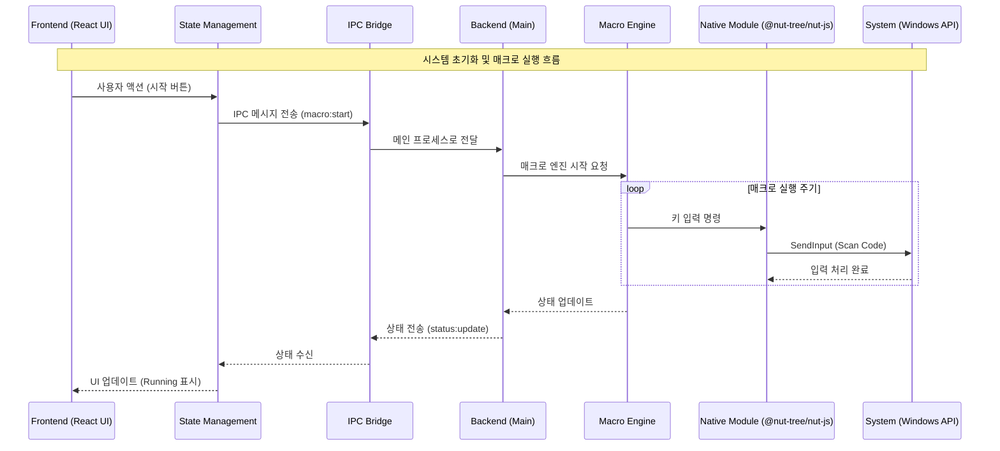

### 🔄 데이터 흐름 아키텍처

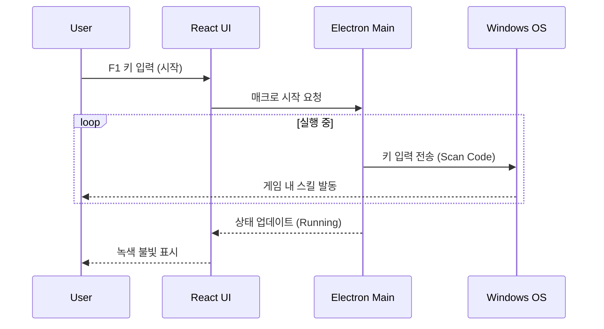

### 🗂️ 프로젝트 구조 다이어그램

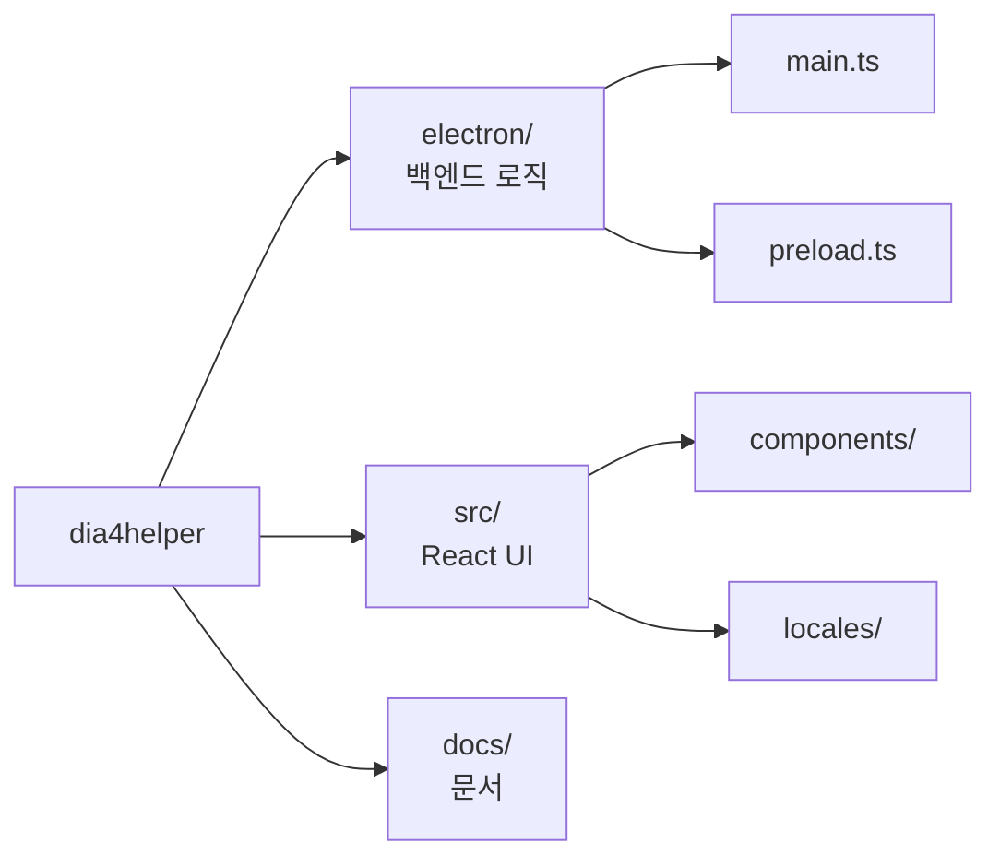

### 🔐 보안 아키텍처

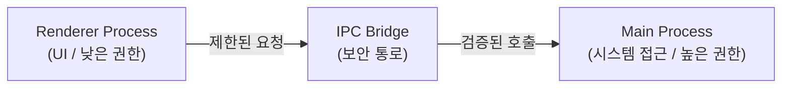

---

## 키보드 매크로 라이브러리

### 📚 사용된 라이브러리

이 프로젝트는 키보드 매크로 구현을 위해 다음 라이브러리들을 사용했습니다:

#### 1. **@nut-tree-fork/nut-js** (현재 사용 중) ✅

```json
"@nut-tree-fork/nut-js": "^4.2.6"
```

**특징:**

- Node.js용 크로스 플랫폼 데스크톱 자동화 라이브러리
- 키보드, 마우스, 화면 제어 가능
- **Scan Code 전송 지원** - DirectX 게임에서 작동
- TypeScript 타입 정의 포함

**장점:**

- ✅ 디아블로 4 같은 DirectX 게임에서 정상 작동
- ✅ 설치가 비교적 간단 (node-gyp 불필요)
- ✅ 활발한 유지보수 (fork 버전)
- ✅ Promise 기반 API로 async/await 사용 가능

**단점:**

- ⚠️ 네이티브 모듈 의존성 (일부 환경에서 빌드 이슈)

**사용 예시:**

```typescript
import { keyboard, Key } from "@nut-tree-fork/nut-js";

// 키 입력
await keyboard.type(Key.A);
await keyboard.pressKey(Key.LeftShift);
```

#### 2. **koffi** (FFI 용도)

```json
"koffi": "^2.14.1"
```

**특징:**

- Node.js용 FFI (Foreign Function Interface) 라이브러리
- C/C++ 네이티브 코드를 직접 호출 가능
- Windows API 직접 접근용

**용도:**

- Windows SendInput API 직접 호출
- 더 정밀한 키 입력 제어
- 하드웨어 스캔 코드 전송

**사용 예시:**

```typescript
import koffi from "koffi";

const user32 = koffi.load("user32.dll");
const SendInput = user32.func("uint32 SendInput(uint32, INPUT*, int32)");
```

### 🚫 과거에 시도했던 라이브러리들

#### ❌ robotjs (제거됨)

**문제점:**

1. **설치 이슈** - Python 2.7 및 Visual Studio Build Tools 필수
2. **node-gyp 빌드 실패** - Windows 환경에서 자주 실패
3. **DirectX 호환성** - Virtual Key Code만 전송하여 디아블로 4에서 작동 안 함
4. **유지보수 중단** - 오래된 라이브러리로 업데이트 없음

**에러 예시:**

```bash
npm install --global windows-build-tools
node-gyp rebuild
# 오류: Python 2.7 not found
# 오류: MSBuild.exe not found
```

**GEMINI.md에서 언급:**

> ### 1. robotjs 설치 문제
>
> - **증상**: `node-gyp rebuild` 실패
> - **원인**: Python 2.7 및 Visual Studio Build Tools 필요

---

## 문제 해결 히스토리

### 🐛 주요 이슈와 해결 과정

#### Issue #1: DirectX 게임에서 키 입력 무시

**증상:**

- 메모장에서는 정상 작동
- 디아블로 4에서는 키 입력이 전혀 인식되지 않음

**원인 분석:**

```
DirectX 게임은 Virtual Key Code를 무시하고
하드웨어 스캔 코드(Scan Code)만 인식함
```

**해결 과정:**

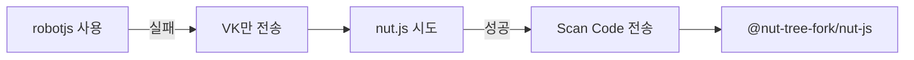

**최종 솔루션:**

```typescript
// ❌ 작동 안 함 (Virtual Key만 전송)
robot.keyTap("a");

// ✅ 작동함 (Scan Code 전송)
import { keyboard, Key } from "@nut-tree-fork/nut-js";
await keyboard.type(Key.A);
```

**docs/bug_guide.md 발췌:**

> Standard virtual key codes (VK) sent by libraries like `robotjs` or `nut.js` are often ignored by DirectX games (like Diablo 4) because they poll hardware scan codes directly.
>
> **Solution**: Use Scan Codes - ensure the FFI library populates the `wScan` field of the `KEYBDINPUT` structure and sets the `KEYEVENTF_SCANCODE` flag.

---

#### Issue #2: 글로벌 단축키 제약

**증상:**

- Tab, Enter, Esc 키가 Stop Keys로 작동 안 함
- 일부 시스템 예약 키 등록 불가

**원인:**

```
Windows OS가 특정 키를 시스템 레벨에서 가로챔
표준 Electron globalShortcut API의 한계
```

**해결 방법:**

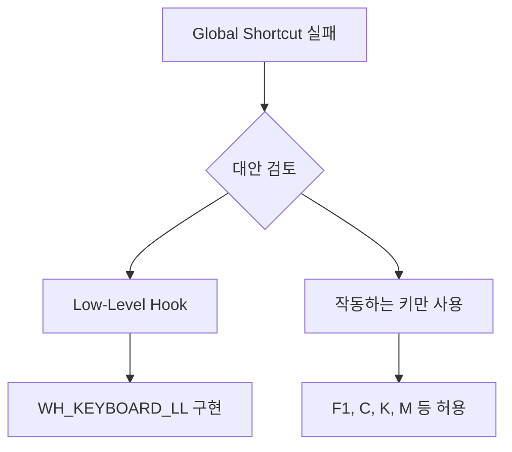

**권장 사항:**

- ✅ F1~F12: 대부분 작동
- ✅ C, K, M, F: 작동
- ⚠️ Tab: 시스템 제약으로 불안정
- ❌ Win, Esc: 등록 불가

---

#### Issue #3: 빌드 의존성 문제

**증상:**

```bash
npm install
# 오류: node-gyp rebuild failed
# 오류: Python 2 not found
```

**해결 과정:**

| 단계 | 시도                       | 결과             |
| ---- | -------------------------- | ---------------- |
| 1    | robotjs 사용               | ❌ node-gyp 실패 |
| 2    | windows-build-tools 설치   | ⚠️ 2시간+ 소요   |
| 3    | pre-built binaries 검색    | ❌ 버전 불일치   |
| 4    | @nut-tree-fork/nut-js 전환 | ✅ 설치 성공     |

**최종 솔루션:**

```json
{
  "dependencies": {
    "@nut-tree-fork/nut-js": "^4.2.6", // ✅ node-gyp 불필요
    "koffi": "^2.14.1" // ✅ FFI 용도
  }
}
```

---

#### Issue #4: 다국어 상태 표시 오류

**증상:**

- 상태가 "Running"으로 하드코딩됨
- 언어 변경 시 일부 텍스트만 번역됨

**원인:**

```typescript
// ❌ 잘못된 코드
const statusText = currentStatus.state === "running" ? "Running" : "Stopped";
```

**해결:**

```typescript
// ✅ 올바른 코드
const statusText = t(`status.${currentStatus.state}`);

// locales/ko/translation.json
{
  "status": {
    "running": "실행 중",
    "stopped": "정지됨",
    "paused": "일시정지"
  }
}
```

---

#### Issue #5: 간격 너무 짧을 때 CPU 과부하

**증상:**

- 간격을 10ms 이하로 설정 시 CPU 100% 사용
- 프로그램 버벅임 및 응답 없음

**분석:**

```
setInterval(callback, 10) 반복 호출
→ 1초당 100회 이벤트 루프
→ CPU 과부하
```

**해결 방법:**

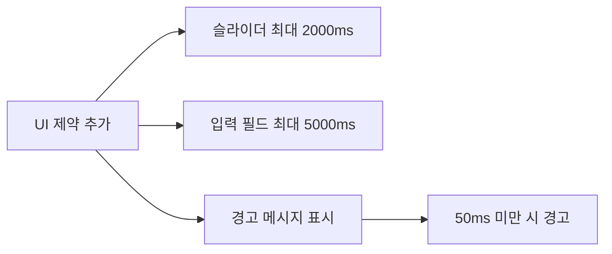

**권장 간격:**

- 일반 스킬: 500~1000ms
- 빠른 스킬: 100~300ms
- 최소값: 50ms (안전)

---

## 기술 스택 상세

### 🎨 프론트엔드

| 기술              | 버전    | 역할          | 특징                                  |
| :---------------- | :------ | :------------ | :------------------------------------ |
| **React**         | 18.2.0  | UI 프레임워크 | Hooks 기반 상태 관리, 컴포넌트 재사용 |
| **TypeScript**    | 5.3.0   | 개발 언어     | 강력한 타입 시스템, 인텔리센스 지원   |
| **Vite**          | 5.0.0   | 빌드 도구     | 빠른 HMR, 최적화된 번들링             |
| **i18next**       | 23.7.0  | 다국어 처리   | 4개 언어(한/영/일/중) 지원, 동적 전환 |
| **Framer Motion** | ^10.0.0 | 애니메이션    | 부드러운 상태 전환, 제스처 지원       |

### ⚙️ 백엔드

| 기술               | 버전   | 역할          | 특징                                           |
| :----------------- | :----- | :------------ | :--------------------------------------------- |
| **Electron**       | 27.0.0 | 앱 프레임워크 | 데스크톱 네이티브 통합, 프로세스 관리          |
| **nut.js** (Fork)  | 4.2.6  | 매크로 엔진   | 키보드 제어, **Scan Code 전송** (DirectX 호환) |
| **electron-store** | 8.1.0  | 데이터 저장소 | 설정값 자동 저장/복원 (JSON)                   |
| **koffi**          | 2.14.1 | FFI (Native)  | Windows API 직접 호출 (SendInput)              |

### 🎨 UI/UX 디자인 시스템

#### 색상 팔레트

```css
/* 다크 테마 */
--bg-primary: #1a1a1a; /* 메인 배경 (거의 검정) */
--bg-secondary: #242424; /* 패널 배경 */
--bg-tertiary: #2d2d2d; /* 카드 배경 */

/* 디아블로 레드 */
--accent-red: #7c3f3f; /* 메인 강조색 */
--border-red: #6b3030; /* 레드 테두리 */

/* 골드 액센트 */
--accent-gold: #d4af37; /* 표준 골드 */
--border-gold: #8b7355; /* 브론즈/골드 테두리 */
--text-gold: #c9aa71; /* 골드 텍스트 */

/* 상태 색상 */
--accent-green: #4a7c3f; /* 실행 중 (녹색) */
--text-red: #ff6b6b; /* 경고/에러 */
```

#### 타이포그래피

| 용도      | 폰트         | 특징             |
| --------- | ------------ | ---------------- |
| 제목/헤더 | Cinzel       | 고딕/중세 스타일 |
| 한국어    | Noto Sans KR | 가독성 좋음      |
| 키 표시   | Monospace    | 등폭 폰트        |

---

## 핵심 기능 분석

### 🎯 8개 스킬 슬롯 시스템

#### 기술적 구현

```typescript
interface SkillSlotConfig {
  slotNumber: 1 | 2 | 3 | 4 | 5 | 6 | 7 | 8;
  key: string; // '1', 'Q', 'Space', 'MouseLeft'
  interval: number; // 0~5000ms
  enabled: boolean; // 활성화 여부
}
```

#### 동작 흐름

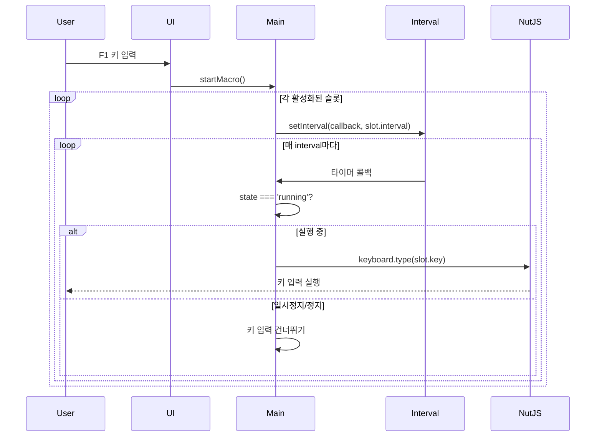

#### 핵심 코드 (electron/main.ts)

```typescript
function startMacro() {
  config.skillSlots.forEach((slot) => {
    if (slot.enabled && slot.key) {
      const timer = setInterval(async () => {
        if (currentStatus.state === "running") {
          // Scan Code 전송
          await keyboard.type(Key[slot.key]);
        }
      }, slot.interval);

      macroIntervals.set(slot.slotNumber, timer);
    }
  });

  currentStatus.state = "running";
  sendStatusUpdate();
}
```

---

### 🛑 Stop Keys (자동 일시정지)

#### 매핑 테이블

```typescript
export const STOP_KEY_MAPPING = {
  inventory: "C", // 인벤토리
  skills: "K", // 스킬 트리
  follower: "F", // 용병
  map: "Tab", // 맵
  worldMap: "M", // 월드맵
  townPortal: "T", // 귀환 포털
  chat: "Enter", // 채팅
  whisper: "/", // 귓속말
};
```

#### 토글 방식

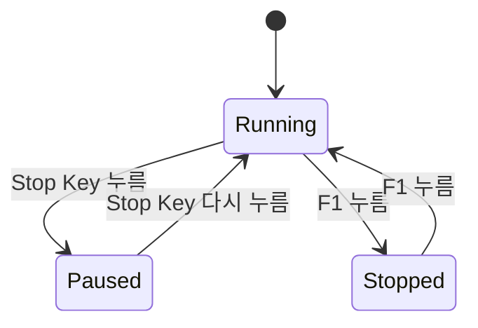

#### 구현 로직

```typescript
// Stop Key 등록
Object.entries(STOP_KEY_MAPPING).forEach(([name, key]) => {
  if (config.stopKeys[name]) {
    globalShortcut.register(key, () => {
      if (currentStatus.state === "running") {
        pauseMacro("stopKey");
      } else if (currentStatus.state === "paused") {
        resumeMacro();
      }
    });
  }
});
```

---

### 🔑 Special Key (Hold to Pause)

#### 동작 방식

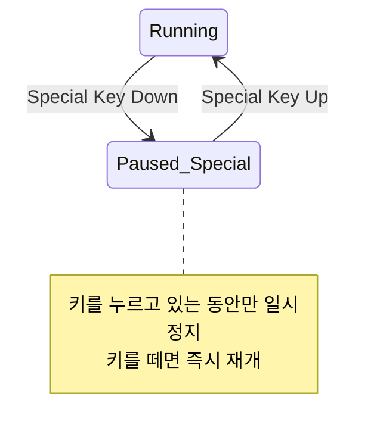

#### 사용 사례

| 상황      | Special Key | 효과                |
| --------- | ----------- | ------------------- |
| 정밀 조준 | Shift       | 조준 중 매크로 정지 |
| 이동      | Alt         | 이동 중 스킬 정지   |
| 상호작용  | Ctrl        | NPC 대화 중 정지    |

---

## 데이터 흐름 및 통신

### 🔄 IPC 통신 구조


### 📡 IPC 채널 목록

#### Renderer → Main (Invoke)

| 채널명            | 파라미터           | 응답                 | 설명          |
| ----------------- | ------------------ | -------------------- | ------------- |
| `macro:start`     | -                  | `{success: boolean}` | 매크로 시작   |
| `macro:stop`      | -                  | `{success: boolean}` | 매크로 정지   |
| `macro:pause`     | `{reason: string}` | `{success: boolean}` | 일시정지      |
| `macro:resume`    | -                  | `{success: boolean}` | 재개          |
| `config:save`     | `AppConfig`        | `{success: boolean}` | 설정 저장     |
| `config:load`     | -                  | `AppConfig`          | 설정 불러오기 |
| `window:minimize` | -                  | -                    | 창 최소화     |
| `window:maximize` | -                  | -                    | 창 최대화     |
| `window:close`    | -                  | -                    | 창 닫기       |

#### Main → Renderer (Send)

| 채널명          | 페이로드            | 설명               |
| --------------- | ------------------- | ------------------ |
| `status:update` | `MacroStatus`       | 실행 상태 업데이트 |
| `error:notify`  | `{message: string}` | 오류 알림          |

### 💾 설정 저장소

#### electron-store 구조

```json
{
  "version": "1.0.1",
  "language": "ko",
  "startStopKey": "F1",
  "skillSlots": [
    {
      "slotNumber": 1,
      "key": "1",
      "interval": 11,
      "enabled": true
    }
    // ... 8개 슬롯
  ],
  "stopKeys": {
    "inventory": true,
    "skills": false
    // ...
  },
  "specialKey": {
    "key": "Shift",
    "enabled": false
  },
  "options": {
    "randomDelay": false,
    "randomDelayPercent": 10
  }
}
```

#### 저장 위치

```
Windows: C:\Users\[Username]\AppData\Roaming\d4-helper\config.json
```

---

## 성능 및 최적화

### 📊 리소스 사용률

| 항목   | Idle   | 실행 중 |
| ------ | ------ | ------- |
| 메모리 | ~100MB | ~120MB  |
| CPU    | < 1%   | < 5%    |
| 디스크 | 0 MB/s | 0 MB/s  |

### ⚡ 권장 설정

```typescript
// 권장 간격 범위
const RECOMMENDED_INTERVALS = {
  minimum: 50, // 최소 50ms (CPU 부하 방지)
  fast: 100, // 빠른 스킬 (회피, 이동)
  normal: 500, // 일반 스킬
  slow: 1000, // 쿨타임 긴 스킬
  maximum: 5000, // 최대 5초
};
```

---

## 보안 고려사항

### 🔒 Electron 보안 설정

```typescript
// electron/main.ts
const win = new BrowserWindow({
  webPreferences: {
    contextIsolation: true, // ✅ 컨텍스트 격리
    nodeIntegration: false, // ✅ Node.js 접근 차단
    preload: path.join(__dirname, "preload.js"),
  },
});
```

### ⚠️ 사용자 주의사항

> **경고**: 이 프로그램은 교육 목적으로 제작되었습니다.
>
> 1. **게임 이용약관 위반 가능**
>
>    - 대부분의 온라인 게임은 매크로 사용 금지
>    - 계정 정지 또는 영구 차단 위험
>
> 2. **안티치트 감지 가능**
>
>    - 소프트웨어 레벨 키 입력 감지됨
>    - 공식 서버 사용 시 위험 감수 필요
>
> 3. **권장 사용 환경**
>    - 오프라인 게임
>    - 개인 테스트 서버
>    - 교육 및 학습 목적

---

## 향후 개선 방향

### 🚀 계획된 기능

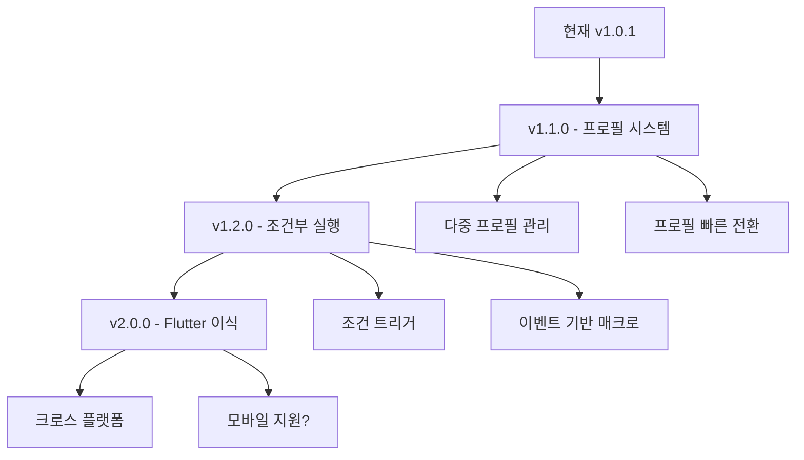

### 📋 개선 항목

- [ ] **프로필 시스템** - 캐릭터/빌드별 설정 저장
- [ ] **트레이 아이콘** - 최소화 시 시스템 트레이로
- [ ] **글로벌 오버레이** - 게임 위 투명 UI
- [ ] **매크로 레코딩** - 키 입력 녹화 및 재생
- [ ] **클릭 자동화** - 마우스 위치 저장 후 클릭
- [ ] **조건부 트리거** - HP/마나 기반 실행
- [ ] **통계 대시보드** - 사용 시간, 입력 횟수 통계

---

## 참고 자료

### 📚 문서 링크

- [Electron 공식 문서](https://www.electronjs.org/docs)
- [React 공식 문서](https://react.dev)
- [nut.js 문서](https://nutjs.dev)
- [i18next 문서](https://www.i18next.com)

### 📁 프로젝트 문서

- [GEMINI.md](../GEMINI.md) - AI 컨텍스트 문서
- [PROJECT_SUMMARY.md](../PROJECT_SUMMARY.md) - 프로젝트 요약
- [USER_MANUAL_KO.md](./USER_MANUAL_KO.md) - 사용자 매뉴얼
- [bug_guide.md](./bug_guide.md) - 버그 해결 가이드

---

**문서 버전**: 1.0  
**마지막 업데이트**: 2025-12-06  
**작성**: AI 분석 문서
