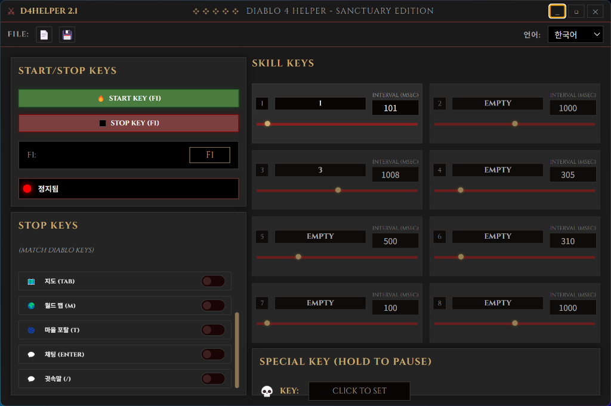

# D4 Helper - Sanctuary Edition (v2.0.1)



## 📋 프로젝트 개요 (Project Overview)

**D4 Helper**는 디아블로 4 플레이어를 위한 강력한 스킬 자동화 도구입니다. 반복적인 스킬 사용을 자동화하여 손목 피로를 줄이고 게임 플레이에 집중할 수 있도록 돕습니다.

**v2.0.1**에서는 **ESC 키 긴급 정지**, **오버레이 레이아웃 초기화**, **향상된 사용성**이 추가되어 더욱 편리해졌습니다.

---

## ✨ 주요 기능 (Key Features)

### 1. 🔄 다중 프로필 시스템 (Multi-Profile System)

- 여러 캐릭터나 빌드에 맞춰 **서로 다른 설정(프로필)**을 저장하고 관리할 수 있습니다.
- 각 프로필마다 독립적인 **시작/정지 단축키**를 설정할 수 있어, 프로필 전환 없이도 여러 매크로를 동시에 운용하거나 쉽게 전환할 수 있습니다.
- 예:
  - **프로필 1 (야만용사)**: F1 키로 시작
  - **프로필 2 (원소술사)**: F2 키로 시작

### 2. 🖥️ 이동 가능한 오버레이 (Movable Overlay)

- 게임 화면 위에 현재 매크로 상태(실행 중/정지/일시정지)를 보여주는 오버레이 위젯을 제공합니다.
- **레이아웃 표시** 모드로 오버레이 위치를 자유롭게 드래그하여 원하는 곳에 배치할 수 있습니다.
- **레이아웃 초기화** 기능으로 오버레이가 화면 밖으로 사라졌을 때 즉시 복구할 수 있습니다. **[NEW in 2.0.1]**

### 3. 🚨 ESC 키 긴급 정지 (Emergency Stop) **[NEW in 2.0.1]**

- 게임 내에서 **ESC 키**를 누르면 실행 중인 **모든 프로필**이 즉시 중단됩니다.
- 예상치 못한 상황에서 빠르게 매크로를 종료할 수 있습니다.

### 4. 💾 창 위치 및 설정 자동 저장 (Auto-Save)

- 프로그램의 창 위치와 오버레이 위치가 자동으로 저장되어, 다음 실행 시 마지막 위치에서 열립니다.
- 모든 설정 변경 사항은 즉시 로컬에 안전하게 저장됩니다.

### 5. ⚡ 8개 스킬 슬롯 (8 Skill Slots)

- 최대 8개의 스킬 슬롯을 개별적으로 설정할 수 있습니다.
- **지원 입력**: 키보드 모든 키, 마우스 좌/우/휠 클릭
- **간격 설정**: 0ms ~ 5000ms까지 정밀한 간격 조절 가능

### 6. 🛑 스마트 일시정지 (Smart Pause)

- **Stop Keys**: 인벤토리(C), 스킬창(K), 지도(M), 채팅(Enter) 등 게임 UI를 열 때 매크로가 자동으로 일시정지됩니다.
- **Hold to Pause**: 특정 키(예: Shift)를 누르고 있는 동안만 매크로를 일시정지하여 정밀한 컨트롤이 가능합니다.

### 7. 🌍 다국어 지원 (Multi-language)

- 한국어 (Korean)
- English
- 日本語 (Japanese)
- 简体中文 (Simplified Chinese)

---

## 🚀 설치 및 실행 (Installation & Run)

### 요구 사항 (Requirements)

- Windows 10/11 (64-bit)
- Node.js 18+ (개발 시)

### 사용자용 설치 (For Users)

1. [Releases](https://github.com/your-repo/d4-helper/releases) 페이지에서 `D4Helper_v2.0.1.exe` 다운로드
2. 실행 파일을 더블클릭하여 실행
3. 프로그램이 자동으로 시작됩니다

### 개발 환경 설정 (Development Setup)

이 프로젝트는 **Bun** 패키지 매니저를 권장합니다.

```bash
# 1. 저장소 클론
git clone https://github.com/your-repo/d4-helper.git
cd d4-helper

# 2. 의존성 설치
bun install

# 3. 개발 모드 실행 (Electron + React)
bun run electron:dev
```

### 빌드 (Build)

```bash
# 프로덕션 빌드 (Windows .exe 생성)
bun run electron:build
```

빌드 결과물은 `release/` 폴더에 생성됩니다.

---

## 📖 사용 방법 (Usage Guide)

### 기본 사용법

1. **프로필 생성**: 좌측 패널에서 `+` 버튼으로 프로필 생성
2. **키 설정**: 사용할 스킬 키와 간격(ms)을 입력
3. **시작 키 설정**: 프로필 우클릭 → "시작/정지 키 변경" (F1-F12 권장)
4. **활성화**: 사용하려는 스킬 슬롯의 스위치를 ON
5. **실행**: 게임 내에서 설정한 **시작 키**를 누르면 매크로 작동

### 오버레이 사용법

1. **이동**: 메뉴바에서 `📐 레이아웃 표시` → 오버레이 드래그 → 다시 `📐 레이아웃 표시`
2. **초기화**: `📐 레이아웃 표시` 활성화 → `↺` 버튼 클릭

### 긴급 정지

- 게임 중 **ESC 키**를 누르면 모든 프로필 즉시 중단

자세한 사용법은 [사용자 가이드](./docs/USER_GUIDE.md)를 참조하세요.

---

## 🛠️ 기술 스택 (Tech Stack)

- **Runtime**: Electron 27+, Node.js 18+
- **Frontend**: React 18, TypeScript, Vite
- **Styling**: Custom CSS (Diablo Theme)
- **Package Manager**: Bun
- **Native Control**: koffi (Windows API)
- **State Management**: React Hooks + Electron IPC

---

## 📚 문서 (Documentation)

- [사용자 가이드 (USER_GUIDE.md)](./docs/USER_GUIDE.md) - 상세한 사용 방법
- [기술 문서 (TECHNICAL_DOC.md)](./docs/TECHNICAL_DOC.md) - 개발자용 기술 문서
- [변경 로그 (CHANGELOG.md)](./docs/CHANGELOG.md) - 버전별 변경 사항

---

## 🆕 What's New in v2.0.1

### 추가된 기능

- ✅ **ESC 키 긴급 정지**: 모든 프로필 즉시 중단
- ✅ **레이아웃 초기화 버튼**: 오버레이 위치 복구
- ✅ **향상된 오버레이 관리**: 자동 생성 및 표시

### 개선 사항

- 🔧 레이아웃 초기화 시 확인 창 제거 (즉시 실행)
- 🔧 초기화 완료 알림 메시지 추가
- 🔧 오버레이 윈도우 생명주기 개선

자세한 내용은 [CHANGELOG.md](./docs/CHANGELOG.md)를 참조하세요.

---

## ⚠️ 주의사항 (Disclaimer)

- 이 프로그램은 **교육 및 학습 목적**으로 개발되었습니다.
- 게임사의 약관에 위배될 수 있으므로, 실제 게임에서의 사용에 대한 책임은 전적으로 사용자에게 있습니다.
- 과도한 자동화는 계정 제재의 원인이 될 수 있습니다.

---

## 📝 라이선스 (License)

MIT License - 상업적 사용 가능, 수정 및 배포 자유

---

**Version**: 2.0.1  
**Last Updated**: 2025-12-13  
**Developer**: WAYNE
